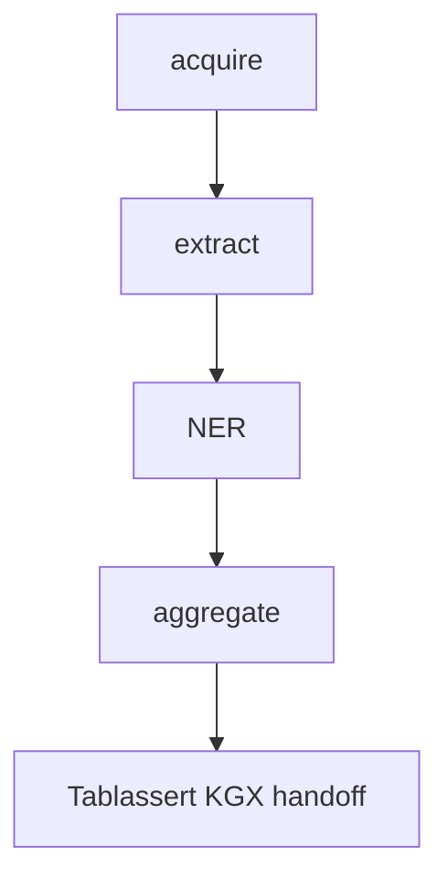

# DAKP

[](https://github.com/glusman-team/dakp/actions/workflows/ci.yml)
[](https://github.com/glusman-team/dakp/blob/main/LICENSE)
[](https://github.com/glusman-team/dakp/stargazers)

**Drug Approvals Knowledge Provider**: one reproducible pipeline that turns DailyMed,
Drugs@FDA, FAERS, and the EMA medicines registry into Translator assertion tables, ready for
[Tablassert](https://pypi.org/project/tablassert/) KGX modeling.

DAKP downloads the real FDA and EMA sources, extracts treatment and contraindication assertions,
mines disease mentions with NER, and aggregates everything into three TSV assertion tables. It then
generates Tablassert configs and hands canonical resolution and KGX compilation to the installed
`tablassert` CLI.



## Quick start

Requires [`uv`](https://docs.astral.sh/uv/) (installs every dependency, including Airflow 3, GLiNER,
and `tablassert[qc]`, plus the `dakp` CLI) and a Go toolchain (used to build the native bundle).

```bash
make setup
uv run dakp up --small   # bounded real-data dev run (~1 FAERS quarter + 1 DailyMed release)
uv run dakp down         # stop the local Airflow
```

For a full production run with the KGX handoff:

```bash
uv run dakp up --fullmap /path/to/fullmap.redb
```

`dakp up` builds the native Go bundle, starts a local Airflow, triggers the `dakp_pipeline`
DAG, waits, and reports the final run state. Without `--fullmap` the Tablassert handoff is
deferred (a manifest is written), never an error. Acquisition is always real; "offline" is
only a test concern.

To export the MEDliNER training-data bundle without running Airflow:

```bash
uv run dakp export-medliner --out /path/to/bundle                 # from a materialized workdir
uv run dakp export-medliner --fixtures --out tmp/medliner-bundle  # offline, from committed fixtures
```

`dakp clean` removes caches, `tmp/`, and the Go worker binary when you want a fresh slate;
`dakp clean --ner-only` (`-no`) removes only the NER mention cache (the Pebble store of
BLAKE3-keyed mentions under `tmp/cache/ner/`), e.g. to force re-mining without losing the rest.

## Pipeline stages

- **acquire**: real, idempotent downloaders for DailyMed, Drugs@FDA, FAERS, and the EMA
  medicines report. Artifacts are content-addressed and freshness-gated (7-day cache window),
  so re-runs skip tens of GB.
- **extract**: heavy parsers run as native Go workers ([`go/`](./go)); the EMA medicines xlsx is
  parsed in Python (`fastexcel`) down to the Authorised, Human centrally-authorised rows.
- **NER**: a composite DiseaseNER (curated gazetteer + GLiNER2 recall) mines
  disease/phenotype mentions from DailyMed sections and EMA EPAR therapeutic-indication text; it
  emits mentions only, never ontology CURIEs. FAERS observed-use shaping bypasses NER and leaves
  FAERS drug names as text-first intervention subjects for Tablassert mapping.
- **aggregate**: joins the extracts and NER mentions into the DailyMed-backed tables, unions the
  EMA-derived approved-treats rows (registry MeSH therapeutic areas plus mined EPAR indications),
  and aggregates FAERS observed-use rows without NER.
- **Tablassert handoff**: generates a graph config plus one table config per assertion table,
  then delegates to `tablassert build-kg` and validates the emitted KGX against the DAKP
  Translator contract — bare-`biolink:Association` edges, off-allow-list node categories, or
  values relocated into `has_supporting_studies` fail the build before export/publish.
- **legacy TSV export**: retrofits the KGX pair into the pre-rewrite DAKP TSV schema for the
  internal service that still consumes it.
- **MEDliNER export**: hands the annotation corpus to MEDliNER as a deterministic,
  self-describing `dakp.medliner.export.v1` bundle under `<workdir>/store/medliner-export`.

## Text normalization

DAKP normalizes source text, never ontology IDs: mention text goes in, mention text comes
out, and Tablassert/fullmap resolves it at build-kg time. The chain lives in
`src/dakp_pipeline/textnorm.py` as a string twin (`defaers_text`) and a polars twin
(`defaersify`) that must agree on every input class (the test suite cross-checks them).

Order matters:

1. Combo canonicalization: multi-ingredient packaging/drugname strings join ingredients
   with `\` or `;`; each component runs the full chain below, empty components drop, and
   survivors join with ` / ` (the fullmap mixture-wording convention). Policy: one FAERS
   case contributes to ONE product edge at mixture level; components are never split into
   per-ingredient edges, because case attribution is at product level and splitting would
   fabricate per-ingredient evidence. Bare `/` (salt-pair notation) is not a separator.
2. `?` -> `-` separator restoration and collapsed-hyphen repair (FAERS ASCII mangling).
3. Dosage/form tail truncation, `#` line labels, empty parens, trailing periods, legacy
   `.GREEK.` tokens, fully-wrapped parens.
4. Brand aliases: a small curated regex table (`BRAND_ALIASES`) maps brand spellings to
   generic ingredient text (XEFO -> Lornoxicam, BETOLVEX -> Cyanocobalamin,
   rADAMTS13 -> apadamtase alfa) so true matches survive Tablassert QC. Entries are
   data-backed only: a rejection must be a TRUE match lost, never a correct garbage-catch.

Invariants: idempotent on clean text; never empties a name; no CURIEs minted anywhere.
The same chain canonicalizes both sides of any pair lookup, so spelling variants of one
(drug, condition) pair derive one `clinical_approval_status`. NER mention surfaces keep
raw text for offsets during matching and are canonicalized only at node-text emission.
The generated table configs additionally word-denylist trap aliases (e.g. CRYING) and
exclude known admin-code concepts (e.g. `UMLS:C1314429`, an HCPCS injection description
categorized as Drug) so wording-channel collisions cannot leak past the category
allow-list.

## Output tables

| Assertion table | Predicate | Subject → Object | Upstream |
| --------------- | --------- | ---------------- | -------- |
| approved-treats | `biolink:treats` | drug → disease/phenotype | DailyMed + Drugs@FDA + FAERS; EMA registry (`infores:ema`) and mined EPAR indications (`infores:epar`) |
| observed-use | `biolink:applied_to_treat` | drug → disease/phenotype | FAERS |
| contraindication | `biolink:contraindicated_in` | drug → disease/phenotype | DailyMed |

## Resource Ingest Guide

The graph config carries a Translator Resource Ingest Guide (RIG) adapted from the
DINGO-reviewed DAKP RIG in
[NCATSTranslator/translator-ingests](https://github.com/NCATSTranslator/translator-ingests)
(review issue #416). `tables/graph.yaml` is generated by the pipeline; regenerate it, never
hand-edit; the test suite enforces byte-equality with the generated output.

## Developing

All dev workflows go through the [Makefile](./Makefile):

```bash
make test        # Python tests; 100% branch coverage gate (fail_under = 100)
make test-go     # Go test suite
make lint        # ruff
make fmt-check   # Python (ruff) and Go (gofmt) formatting checks
make typecheck   # pyright
make vet         # go vet
make check       # full local quality gate, mirrors CI
make precommit   # pre-commit hooks over all files
make clean       # remove build, test, and cache artifacts
```

## License

Apache License 2.0. The bundled aria2c binary is GPLv2 but runs as a separate subprocess, so
it does not affect DAKP's license.
