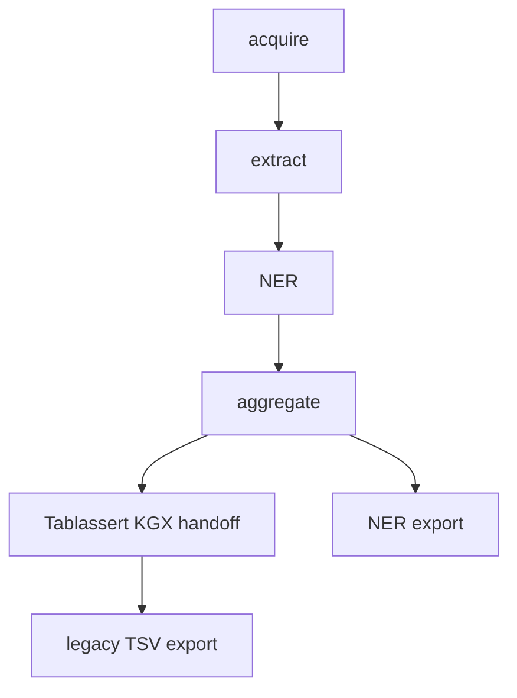

# DAKP

[](https://github.com/glusman-team/dakp/actions/workflows/ci.yml)
[](https://github.com/glusman-team/dakp/blob/main/LICENSE)
[](https://github.com/glusman-team/dakp/stargazers)

**Drug Approvals Knowledge Provider**: one reproducible pipeline that turns DailyMed,
Drugs@FDA, FAERS, Health Canada's Canada Vigilance database, and the EMA medicines registry
and product-information (SmPC) corpus into Translator assertion tables, ready for
[Tablassert](https://pypi.org/project/tablassert/) KGX modeling.

DAKP downloads the real FDA and EMA sources, extracts treatment and contraindication assertions,
mines disease mentions with NER, and aggregates everything into three TSV assertion tables. It then
generates Tablassert configs and hands canonical resolution and KGX compilation to the installed
`tablassert` CLI.


```mermaid
flowchart TD
    acquire --> extract --> NER --> aggregate --> tablassert["Tablassert KGX handoff"]
    tablassert --> legacy["legacy TSV export"]
    aggregate --> nerexport["NER export"]
```

## Quick start

Requires [`uv`](https://docs.astral.sh/uv/) (installs every dependency, including Airflow 3, GLiNER,
and `tablassert[qc]`, plus the `dakp` CLI) and a Go toolchain (used to build the native bundle).

```bash
make setup
uv run dakp up --small   # bounded real-data dev run (~1 FAERS quarter + 1 DailyMed release)
uv run dakp down         # stop the local Airflow
```

For a full production run with the KGX handoff:

```bash
uv run dakp up --fullmap /path/to/fullmap.redb
```

`dakp up` builds the native Go bundle, starts a local Airflow, triggers the `dakp_pipeline`
DAG, waits, and reports the final run state. Without `--fullmap` the Tablassert handoff is
deferred (a manifest is written), never an error. Acquisition is always real; "offline" is
only a test concern.

To export the NER training-data bundle without running Airflow:

```bash
uv run dakp export-ner --out /path/to/bundle   # from a materialized workdir (after `dakp up`); never downloads
```

The export mines every row with the production GLiNER2 backend (GPU), so the model must
be cached under the workdir; there is no offline fixtures mode.

`dakp clean` removes caches, `tmp/`, and the Go worker binary when you want a fresh slate;
`dakp clean --ner-only` (`-no`) removes only the NER mention cache (the Pebble store of
BLAKE3-keyed mentions under `tmp/cache/ner/`), e.g. to force re-mining without losing the rest.

## Pipeline stages

- **acquire**: real, idempotent downloaders for DailyMed, Drugs@FDA, FAERS, Health Canada's
  Canada Vigilance extract, the EMA medicines report, and the EMA product-information (SmPC)
  corpus (the EPAR documents report plus its English human product-information PDFs). Artifacts
  are content-addressed and freshness-gated (7-day cache window), so re-runs skip tens of GB.
- **extract**: heavy parsers run as native Go workers ([`go/`](./go)); the EMA medicines xlsx is
  parsed in Python (`fastexcel`) down to the Authorised, Human centrally-authorised rows, and
  the SmPC PDFs are cut to their QRD 4.1/4.3/4.4 sections in Python (`pypdf`), and the Canada
  Vigilance extract's `$`-delimited members are joined down to suspect drug-indication pairs.
- **NER**: a composite DiseaseNER (curated gazetteer + GLiNER2 recall) mines
  disease/phenotype mentions from DailyMed sections, EMA EPAR therapeutic-indication text, and
  EMA SmPC indication sections; it emits mentions only, never ontology CURIEs. FAERS observed-use
  shaping bypasses NER and leaves FAERS drug names as text-first intervention subjects for
  Tablassert mapping.
- **aggregate**: joins the extracts and NER mentions into the DailyMed-backed tables, unions the
  EMA-derived approved-treats rows (registry MeSH therapeutic areas, mined EPAR indications, and
  mined SmPC indication sections) and EMA SmPC contraindication rows, and aggregates FAERS and
  Canada Vigilance observed-use rows without NER.
- **Tablassert handoff**: generates a graph config plus one table config per assertion table,
  then delegates to `tablassert build-kg` and validates the emitted KGX against the DAKP
  Translator contract — bare-`biolink:Association` edges, off-allow-list node categories, or
  values relocated into `has_supporting_studies` fail the build before export/publish.
- **legacy TSV export**: retrofits the KGX pair into the pre-rewrite DAKP TSV schema for the
  internal service that still consumes it.
- **NER export**: emits a deterministic, self-describing `dakp.ner.export.v1` bundle
  under `<workdir>/store/ner-export`: GLiNER2 training examples as Avro records plus
  their gliner2 NDJSON projection, and the NER gold benchmark.

## Text normalization

DAKP normalizes source text, never ontology IDs: mention text goes in, mention text comes
out, and Tablassert/fullmap resolves it at build-kg time. The chain lives in
`src/dakp_pipeline/textnorm.py` as a string twin (`defaers_text`) and a polars twin
(`defaersify`) that must agree on every input class (the test suite cross-checks them).

Order matters:

1. Combo canonicalization: multi-ingredient packaging/drugname strings join ingredients
   with `\` or `;`; each component runs the full chain below, empty components drop, and
   survivors join with ` / ` (the fullmap mixture-wording convention). Policy: one FAERS
   case contributes to ONE product edge at mixture level; components are never split into
   per-ingredient edges, because case attribution is at product level and splitting would
   fabricate per-ingredient evidence. Bare `/` (salt-pair notation) is not a separator.
2. `?` -> `-` separator restoration and collapsed-hyphen repair (FAERS ASCII mangling).
3. Dosage/form tail truncation, `#` line labels, empty parens, unterminated parenthetical
   tails from ASCII truncation (`ACETYLSALICYLIC ACID (}` -> `ACETYLSALICYLIC ACID`),
   trailing periods, legacy `.GREEK.` tokens, fully-wrapped parens.
4. Brand aliases: a curated regex table (`BRAND_ALIASES`) maps brand spellings to
   generic ingredient text (XEFO -> Lornoxicam, HUMIRA -> Adalimumab, DUPIXENT ->
   Dupilumab, ENBREL -> Etanercept, ZANTAC -> Ranitidine, ...) so true matches survive
   Tablassert QC and the top FAERS brand subjects resolve instead of dropping (v1.13.1
   lost 7.1M cases to unresolved brands). Entries are data-backed only: a rejection must
   be a TRUE match lost, never a correct garbage-catch.

Invariants: idempotent on clean text; never empties a name; no CURIEs minted anywhere.
The same chain canonicalizes both sides of any pair lookup, so spelling variants of one
(drug, condition) pair derive one `clinical_approval_status`. NER mention surfaces keep
raw text for offsets during matching and are canonicalized only at node-text emission.
The generated table configs additionally word-denylist trap aliases (e.g. CRYING) and
exclude known admin-code concepts (e.g. `UMLS:C1314429`, `UMLS:C0812740`, HCPCS injection
descriptions categorized as Drug) so wording-channel collisions cannot leak past the
category allow-list.

## Output tables

| Assertion table | Predicate | Subject → Object | Upstream |
| --------------- | --------- | ---------------- | -------- |
| approved-treats | `biolink:treats` | drug → disease/phenotype | DailyMed + Drugs@FDA + FAERS; EMA registry (`infores:ema`), mined EPAR indications and SmPC indication sections (`infores:epar`) |
| observed-use | `biolink:applied_to_treat` | drug → disease/phenotype | FAERS (`infores:faers`) and Canada Vigilance (`infores:canada-vigilance`) |
| contraindication | `biolink:contraindicated_in` | drug → disease/phenotype | DailyMed (`infores:dailymed`) and EMA SmPC sections (`infores:epar`) |

### Observed-use approval status

Every `applied_to_treat` row carries `clinical_approval_status`: `approved_for_condition` when
the same (drug, condition) pair is label-approved, else `off_label_use` (`not_provided` only when
no approved-treats table was available). The cross-reference answers on three keys, first hit
wins, and the last two only ever add approvals:

1. **FDA application identity**: the row's own application display forms (`NDA021343`) name the
   exact product, and the approved table says which conditions each application covers. This is
   what survives the brand/ingredient spelling gap: FAERS reports `ELIGARD`, the approved row's
   subject is the DailyMed ingredient `LEUPROLIDE`.
2. **Object granularity within one application**: an approved condition occurring whole-word
   inside the observed condition approves it (`prostate cancer` covers `prostate cancer stage
   iv`), the same direction `approved_treats` already accepts when corroborating a report
   against a label. Never across applications, and never in reverse.
3. **Normalized text pair**: the legacy rule, and the only one that answers for a report with
   no application number (64% of production off-label rows).

`tests/eval/approval_status_audit.py` re-derives the status over a real build with the shipped
rule and exits non-zero on any demotion; on the v1.16.0 tables it reports 64,351 rows
(8,364,775 cases) promoted and 0 demoted.

## Resource Ingest Guide

The graph config carries a Translator Resource Ingest Guide (RIG) adapted from the
DINGO-reviewed DAKP RIG in
[NCATSTranslator/translator-ingests](https://github.com/NCATSTranslator/translator-ingests)
(review issue #416). `tables/graph.yaml` is generated by the pipeline; regenerate it, never
hand-edit; the test suite enforces byte-equality with the generated output.

Every version is published to the Hugging Face dataset
[SkyeAv/drug-approvals-kp](https://huggingface.co/datasets/SkyeAv/drug-approvals-kp) under a
version directory (`<version>/DRUG_APPROVALS_KP_<version>.{nodes,edges}.ndjson` plus the
generated `.RIG.yaml`). The RIG's `artifact_base_url` resolves to that per-version release, so
the artifact locations the RIG advertises are the deployed dataset files for the matching
version.

## Developing

All dev workflows go through the [Makefile](./Makefile):

```bash
make test        # Python tests; 100% branch coverage gate (fail_under = 100)
make test-go     # Go test suite
make lint        # ruff
make fmt-check   # Python (ruff) and Go (gofmt) formatting checks
make typecheck   # pyright
make vet         # go vet
make check       # full local quality gate, mirrors CI
make precommit   # pre-commit hooks over all files
make clean       # remove build, test, and cache artifacts
```

## License

Apache License 2.0. The bundled aria2c binary is GPLv2 but runs as a separate subprocess, so
it does not affect DAKP's license.
